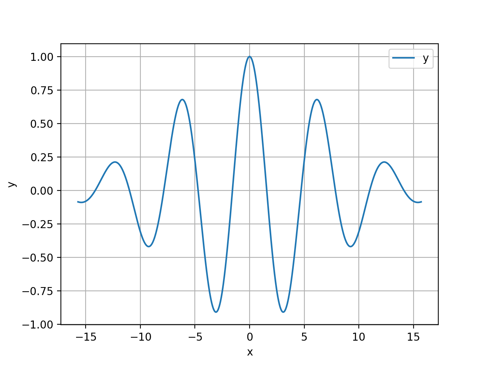
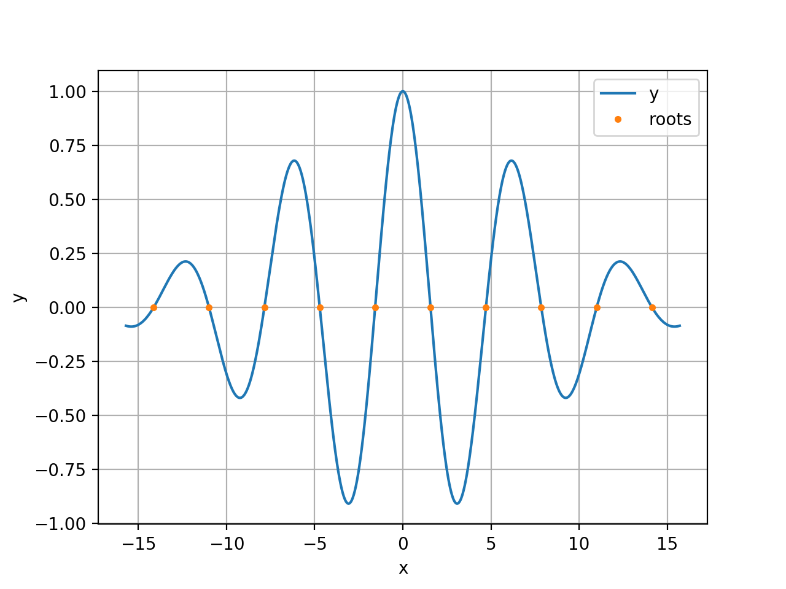
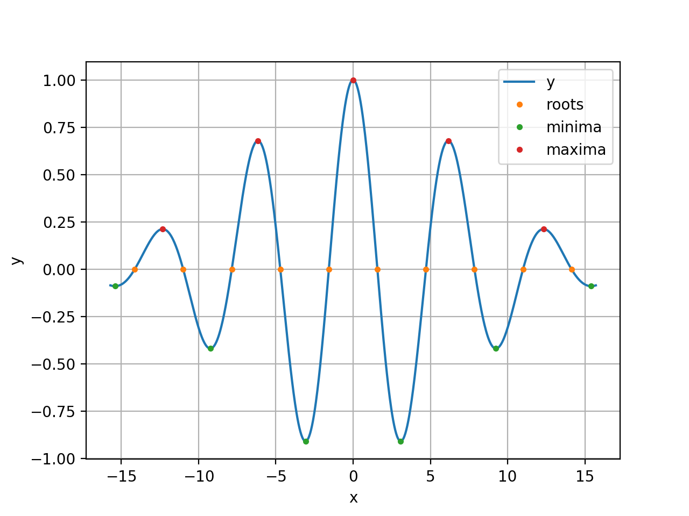

# shamrock
A robust global root finder for real-valued functions of a single real variable.

The core mathematical technology underlying the implementation of the `shamrock` root finder is *Chebyshev approximation* combined with the spectral resolution (i.e., finding eigenvalues) of companion matrices. Everything you need to know about the theory---and more---can be found in this book

[*[STE] "SOLVING TRANSCENDENTAL EQUATIONS: The Chebyshev Polynomial Proxy and Other Numerical Rootfinders, Perturbation Series, and Oracles"*, John P. Boyd, SIAM 2014](https://my.siam.org/Store/Product/viewproduct/?ProductId=25891989)

and the references therein. The book author's academic personal webpage is here: [John P. Boyd](https://clasp.engin.umich.edu/people/john-boyd/)

The name of the package (`shamrock`) pays tribute to Boyd's **Shamrock Principle** [STE, p.34, Fig. 2.2].

**NOTE:** I, the author of the `shamrock` python package availble in this github repository, am not affiliated with Prof. Boyd; neither do I enjoy the privilege of his acquaintance. Prof. Boyd is not aware of the existence of this repo and has not endorsed either approved its content. The previous links are provided solely for informational purposes (if, say, you want to steal the code, but don't know where to start). That said, I highly recommend the linked book; it's **applied maths at its best**.

# Introduction
Suppose, for example, that you are working with a function that looks like this

```python
import numpy as np

def f(x):
    return np.exp(-0.01 * x * x) * np.cos(x)
```
It describes an exponentially decaying cosine and its graph looks like this



Suppose, further, that one of the tasks in hand is to find the roots, minimima, and maxima of `f`. Using the `shamrock` python package, this task can be accomplised as follows:

1. Specify the interval of interest: 
```python
a = -5.0 * np.pi
b = 5.0 * np.pi
I = (a, b)
```

2. Decorate the function:
```python
import shamrock as sh

@sh.ChebProxyDec(I=I)
def f(x):
    return np.exp(-0.01 * x * x) * np.cos(x)
```

3. Find the roots:
```python
roots = f.solve()
```

Here are the roots superimposed on the graph of `f`:



4. Find the local minima and maxima of `f`:
```python
critical, argmin, argmax = f.optimise()
argmin = critical[np.where(argmin == 1)]
argmax = critical[np.where(argmax == 1)]
minvals = f.eval(argmin, mode=b'exact')
maxvals = f.eval(argmax, mode=b'exact')
```

Plotting the graph of the function `f`, the roots, and the local optima in the same axes
```python
import matplotlib.pyplot as plt

plt.figure()
plt.plot(x, y, label='y')
plt.plot(roots, np.zeros((len(roots),)), marker='.', linewidth=0.0, label='roots')
plt.plot(argmin, minvals, marker='.', linewidth=0.0, label='minima')
plt.plot(argmax, maxvals, marker='.', linewidth=0.0, label='maxima')
plt.xlabel('x')
plt.ylabel('y')
plt.grid()
plt.legend()
plt.show()
```

results in the following plot:


