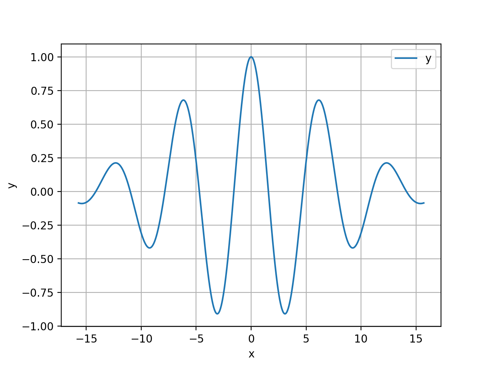
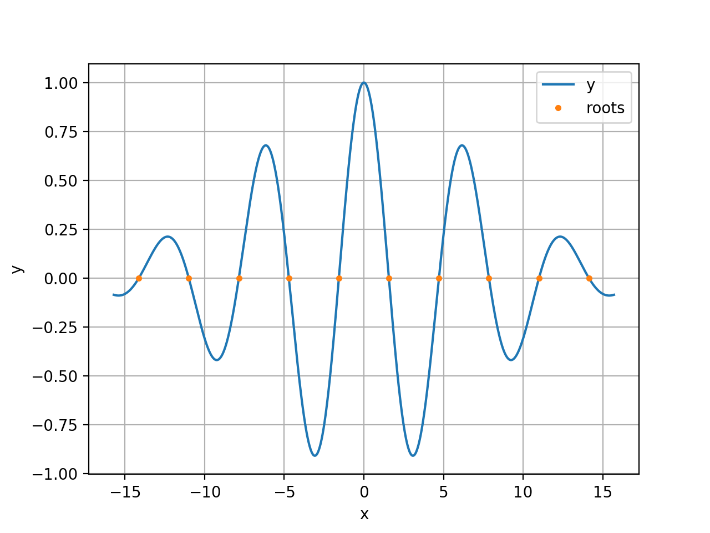

# shamrock
A robust global root finder for real-valued functions of a single real variable.

# Introduction
Suppose, for example, that you are working with a function that looks like this

```python
import numpy as np

def f(x):
    return np.exp(-0.01 * x * x) * np.cos(x)
```
It describes an exponentially decaying cosine and its graph looks like this



Suppose, further, that one of the tasks in hand is to find the roots, minimima, and maxima of `f`. Using the `shamrock` python package, this task can be accomplised as follows:

1. Specify the interval of interest: 
```python
a = -5.0 * np.pi
b = 5.0 * np.pi
I = (a, b)
```

2. Decorate the function:
```python
import shamrock as sh

@sh.ChebProxyDec(I=I)
def f(x):
    return np.exp(-0.01 * x * x) * np.cos(x)
```

3. Find the roots:
```python
roots = f.solve()
```

Here are the roots superimposed on the graph of `f`:

